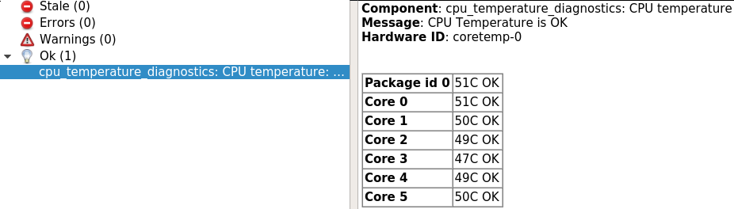

# cpu_temperature_diagnostics
Collect CPU temperature informations and republish them as diagnostics

## Getting started
1. Launch the node with the provided example launch file
````
roslaunch cpu_temperature_diagnostics cpu_temperature_diagnostics.launch
````
2. Viewing the data
````
rosrun rqt_runtime_monitor rqt_runtime_monitor
````


## Launch file example
````
<launch>
      <node name="cpu_temperature_diagnostics" pkg="cpu_temperature_diagnostics" type="cpu_temperature_diagnostics_node" respawn="false">
            <!--Allows to specify the expect prefix for the sensor chips used to get CPU temperature
                  To know the value run the command "sensors" on Intel platform it's "coretemp" 
            This parameter is mandatory-->
            <param name="prefix" value="coretemp" />

            <!-- Allow to override the sensor provided maximum acceptable temperature. This is useful if you run in 
                  a very hot environement and temperatures over max are acceptable. You can also lower the value for a cooler running system -->
            <param name="max_temp_override" value="75" />


            <!-- Allow to override the sensor provided critical temperature. This is useful if you run in 
                  a very hot environement and temperatures over max are acceptable. You can also lower the value for a cooler running system -->
            <param name="critical_temp_override" value="85" />

      </node>
</launch>
````